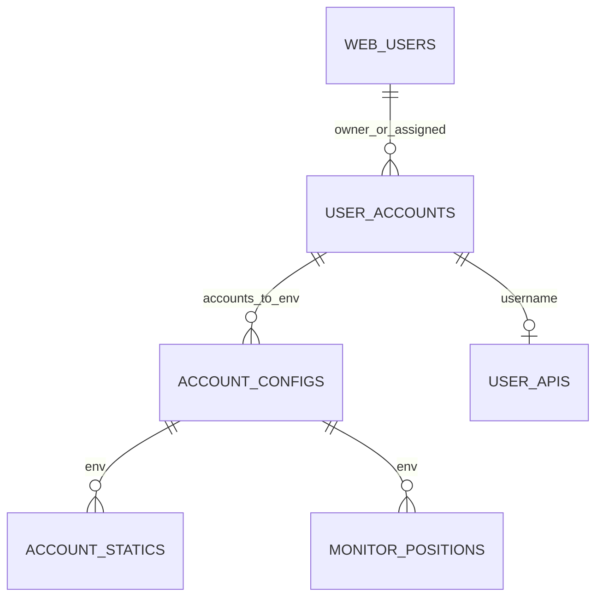

# API và mô hình dữ liệu

Đối chiếu route đã mount ngày 2026-10-09. Bảng liệt kê method/path/source, không phải schema OpenAPI và không thay thế validation trong code. Contract quyền chi tiết nằm ở [spec auth/RBAC](auth-rbac-spec.md).

## Thuật ngữ và quan hệ

| Tên | Nghĩa |
|---|---|
| Web user | Tài khoản đăng nhập trong `web_users`, có role/permission/scopes |
| Bot username | Định danh `user_accounts.username`, dùng tìm credential và tập account |
| Account/config/env | Phần tử `user_accounts.accounts[]`, liên kết `account_configs.env` |
| Owner / assigned | Owner qua `ownerUserId`; assigned qua `web_users.botUsernames` |
| Signal | Tên nguồn/nhóm tín hiệu; ví dụ tài liệu là `SIGNAL_A` |
| Static | Kết quả giao dịch trong `account_statics`, không phải file static frontend |
| Snapshot | Bản tổng hợp có thời gian/version; có thể cũ hơn dữ liệu nguồn |



Đây là quan hệ logic trong code, không phải foreign key được Mongo cưỡng chế. `assigned` là mảng username trên web user, không phải collection liên kết.

## Collection và nơi ghi

| Collection | Nguồn/đối tượng ghi chính | Web sử dụng |
|---|---|---|
| `web_users` | Auth/admin web | Session, role, permission, scope |
| `web_audit_logs` | Web sau mutation | Audit đã sanitize |
| `user_accounts` | Dữ liệu bot dùng chung; web CRUD | Username, accounts, owner, visibility, active |
| `account_configs` | Dữ liệu bot dùng chung; web cập nhật | Trade config, signals, blacklist/whitelist, sync |
| `user_apis` | Cấu hình credential dùng chung; web CRUD | Backend dùng secret, UI chỉ thấy cờ có dữ liệu |
| `signal_infos` | Producer signal phía bot | Lịch sử signal |
| `account_statics` | Bot ghi kết quả lệnh | Static, tìm config, tổng hợp hiệu suất |
| `monitor_positions` | Monitor phía bot | Position/monitor và thống kê |
| `futures_profits` | Bot và thao tác refresh ledger của web | Ví, income, số dư và dòng tiền |
| `futures_symbols` | Dữ liệu symbol phía bot | Tick/step/precision khi hiển thị |
| `telegram_clients` | Cấu hình listener | Web chỉ chọn thông tin channel cần thiết, không trả session/API hash |
| `bot_runtime_logs` | Bot runtime | Log lỗi/cảnh báo, parse/auto-remove |
| `bot_heartbeats` | Process bot | Trạng thái dịch vụ/process |
| `web_summary_snapshots` | Job/refresh summary web | Payload tổng hợp theo range/version và lease |
| `web_summary_cache` | Hàm cache system-summary | Cache riêng, tra call site trước khi kết luận route dùng nó |

Tên collection phải lấy từ [models](../server/src/models), không suy từ tên class Mongoose. Web không tạo dữ liệu lịch sử signal/giao dịch chỉ bằng việc mở trang. Một số schema shared cho phép field ngoài khai báo; response vẫn phải dùng projection/serializer an toàn.

## REST endpoints

Các URL dưới đây gồm mount prefix từ [index.js](../server/src/index.js). `/api/health` public trả `{ok, rateLimitStore}`. Public auth vẫn chịu giới hạn tải, mutation public vẫn chịu CSRF. Các route khác cần auth; permission có thể được kiểm tra trong router hoặc hàm nghiệp vụ.

| Method | Path | Router nguồn |
|---|---|---|
| GET | `/api/health` | [index](../server/src/index.js) |
| GET | `/api/auth/csrf` | [auth](../server/src/routes/auth.js) |
| POST | `/api/auth/register` | [auth](../server/src/routes/auth.js) |
| POST | `/api/auth/login` | [auth](../server/src/routes/auth.js) |
| POST | `/api/auth/logout` | [auth](../server/src/routes/auth.js) |
| GET | `/api/auth/me` | [auth](../server/src/routes/auth.js) |
| PATCH | `/api/auth/me` | [auth](../server/src/routes/auth.js) |
| GET | `/api/bots` | [bots](../server/src/routes/bots.js) |
| GET | `/api/bots/config-search` | [bots](../server/src/routes/bots.js) |
| GET | `/api/bots/assigned-configs` | [bots](../server/src/routes/bots.js) |
| GET | `/api/bots/:username` | [bots](../server/src/routes/bots.js) |
| GET | `/api/bots/:username/configs` | [bots](../server/src/routes/bots.js) |
| GET | `/api/bots/:username/configs/:env` | [bots](../server/src/routes/bots.js) |
| POST | `/api/bots/:username/configs/:env/copy` | [bots](../server/src/routes/bots.js) |
| POST | `/api/bots/:username/configs/bulk` | [bots](../server/src/routes/bots.js) |
| PATCH | `/api/bots/:username/configs/:env` | [bots](../server/src/routes/bots.js) |
| POST | `/api/bots` | [bots](../server/src/routes/bots.js) |
| PATCH | `/api/bots/:username` | [bots](../server/src/routes/bots.js) |
| DELETE | `/api/bots/:username` | [bots](../server/src/routes/bots.js) |
| POST | `/api/bots/:username/accounts` | [bots](../server/src/routes/bots.js) |
| PATCH | `/api/bots/:username/accounts/:env` | [bots](../server/src/routes/bots.js) |
| DELETE | `/api/bots/:username/accounts/:env` | [bots](../server/src/routes/bots.js) |
| GET | `/api/user-apis` | [user-apis](../server/src/routes/user-apis.js) |
| POST | `/api/user-apis` | [user-apis](../server/src/routes/user-apis.js) |
| GET | `/api/user-apis/:username` | [user-apis](../server/src/routes/user-apis.js) |
| PATCH | `/api/user-apis/:username` | [user-apis](../server/src/routes/user-apis.js) |
| DELETE | `/api/user-apis/:username` | [user-apis](../server/src/routes/user-apis.js) |
| GET | `/api/admin/users` | [admin-users](../server/src/routes/admin-users.js) |
| GET | `/api/admin/users/access-control` | [admin-users](../server/src/routes/admin-users.js) |
| POST | `/api/admin/users` | [admin-users](../server/src/routes/admin-users.js) |
| PATCH | `/api/admin/users/:id` | [admin-users](../server/src/routes/admin-users.js) |
| GET | `/api/audit-logs` | [audit-logs](../server/src/routes/audit-logs.js) |
| GET | `/api/runtime-logs` | [runtime-logs](../server/src/routes/runtime-logs.js) |
| GET | `/api/system-health` | [system-health](../server/src/routes/system-health.js) |
| GET | `/api/dashboard` | [dashboard](../server/src/routes/dashboard.js) |
| POST | `/api/dashboard/attention` | [dashboard](../server/src/routes/dashboard.js) |
| GET | `/api/positions` | [positions](../server/src/routes/positions.js) |
| GET | `/api/positions/detail` | [positions](../server/src/routes/positions.js) |
| GET | `/api/summary` | [summary](../server/src/routes/summary.js) |
| POST | `/api/summary/refresh` | [summary](../server/src/routes/summary.js) |
| GET | `/api/signal-history` | [signal-history](../server/src/routes/signal-history.js) |
| GET | `/api/signal-config` | [signal-setup](../server/src/routes/signal-setup.js) |
| POST | `/api/signal-config` | [signal-setup](../server/src/routes/signal-setup.js) |
| GET | `/api/account-statics` | [account-statics](../server/src/routes/account-statics.js) |
| GET | `/api/account-statics/:id` | [account-statics](../server/src/routes/account-statics.js) |
| GET | `/api/account-ledger` | [account-ledger](../server/src/routes/account-ledger.js) |
| POST | `/api/account-ledger/:username/refresh` | [account-ledger](../server/src/routes/account-ledger.js) |

Không có REST `/api/logs`, `/api/user/stats` hay wildcard `/api/signals/*` chỉ vì menu có tên tương tự. Path parameter phải URL-encode.

## Nhóm query/body thường dùng

| Endpoint/nhóm | Input đáng chú ý | Response/giới hạn |
|---|---|---|
| Auth login | `identifier`, `password` | Session user; cookie JWT, không token trong JSON |
| Danh sách bot | `page`, `limit`, `q`, `visibility`, `active`, `audience`, `sort`, `dir` | Bị giới hạn scope actor; query không nâng quyền |
| Config-search | `signal`, `days` hoặc `from/to`, `q`, `minTrades`, `minWinRate`, `profit`, `profitOp`, `sort` | Chỉ config có giao dịch đúng filter |
| PATCH config | Các field được whitelist trong account-config-view | Field không gửi giữ nguyên; không nhận nguyên Mongo document |
| Bulk config | `envs` + cùng patch cho các env | Tối đa 40, response `updated` / `failed` |
| Copy config | `username` đích, `env` đích, `mode=new/replace/sync` | Kiểm tra scope nguồn và đích |
| Signal config POST | `username`, `envs`, `signals`, `action=add/remove` | Tối đa 40 config/20 signal; trả changed theo env và failed |
| Signal history | `signal`, `q`, `side`, `type`, `status`, `from/to`, `page/limit` | Nhật ký signal, không quy đổi thành profit của user |
| Account statics | `username`, `env`, `scope`, `signal`, `from/to`, `book`, `copy`, `closed`, `status`, `profit` | Chi tiết `/:id` cần username để authorize env |
| Ledger | `username`, `days`, `scope` | Đọc DB; POST refresh mới gọi sàn, rate limit riêng |
| Summary | `range=today/3d/7d/30d/90d/all`, `audience` | Payload aggregate hoặc snapshot kèm metadata; refresh có giới hạn |
| Positions | `account`, `audience`, `book` và filter vị thế | Monitor + snapshot sàn đã lọc quyền; detail cần `id` |
| Dashboard attention | `instructions` tùy chọn | Server dựng facts; tối đa 2000 ký tự hướng dẫn, kết quả items/provider |

Danh sách trên là các input để đọc hiểu, không liệt kê mọi giá trị hợp lệ; đọc router/lib khi viết client mới. Không giả định mọi list dùng cùng envelope, page size hay timezone.

## WebSocket position

Upgrade path: `/api/positions/ws`, xử lý ở [position-ws.js](../server/src/lib/position-ws.js), không phải `router.get`. JWT cookie được đọc lúc upgrade. Sau đó `loadPositions` kiểm tra quyền/account cho subscription.

Ví dụ message (dữ liệu giả):

```json
{"type":"watch","account":"bot-demo","audience":"mine","book":"live"}
```

`resume` mang cùng lựa chọn; `pause` dừng watcher. Server trả `{type:"snapshot", ...view}` hoặc `{type:"error", error:...}`. Không dùng socket này để gửi lệnh giao dịch. Xem [luồng và giới hạn](flows.md#4-position-live).

## Lỗi và phân quyền

| Status | Cách đọc |
|---|---|
| 400 | Validation/thiếu cấu hình hoặc hành động không hợp lệ |
| 401 | Không có session hợp lệ; có thể bình thường ở `/auth/me` trước login |
| 403 | Thiếu permission/scope hoặc CSRF origin/token sai |
| 404 | Sai route hoặc tài nguyên không tồn tại; một số route tránh lộ tài nguyên |
| 409 | Xung đột dữ liệu; cũng có thể snapshot đang tính ở refresh |
| 413 | JSON vượt giới hạn 100 KB |
| 429 | Vượt rate limit; tôn trọng Retry-After nếu có |
| 500 | Lỗi backend |
| 502 | Có thể Nginx không kết nối upstream, hoặc API AI lỗi; phân biệt content-type/body/log |
| 503 | Giới hạn concurrency hoặc summary chưa sẵn sàng |

Không thử bỏ middleware khi gặp 403, không tự retry mutation hàng loạt khi response timeout vì thao tác ghi có thể đã xảy ra.
