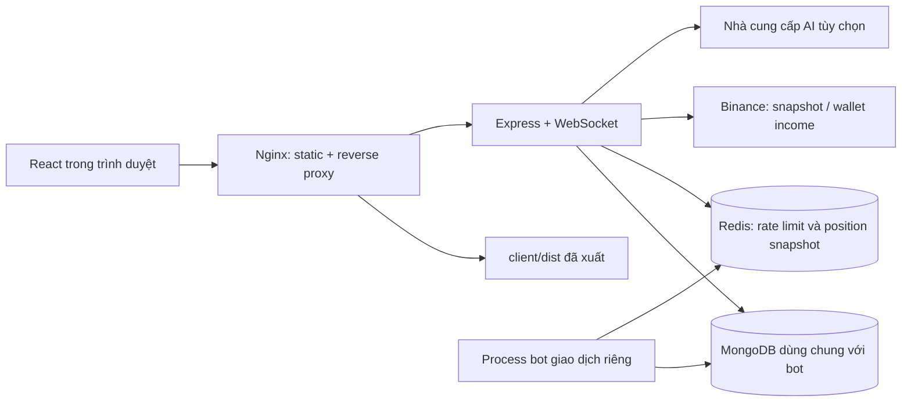

# Kiến trúc và bản đồ project

## Vai trò của web-bot

Dashboard đọc dữ liệu bot, quản lý user/quyền và cập nhật cấu hình trong MongoDB. Tiến trình nhận signal, mở/đóng lệnh, monitor SL/TP và ghi heartbeat thuộc project bot giao dịch riêng. Chạy dashboard không tự khởi động các process đó.

Web vẫn có truy cập Binance: ba API sổ vị thế khi chưa có `wb:ex`, khi bấm cập nhật, hoặc khi sổ quá 15 phút; cập nhật lãi lỗ ví theo yêu cầu. Nút refresh dữ liệu không phải lệnh giao dịch.

## Entry và startup

Nguồn: [index.js](../server/src/index.js), [config.js](../server/src/config.js).

1. Load `.env` ở gốc repo qua dotenv; biến môi trường process có ưu tiên.
2. Validate Mongo URI, JWT secret và port.
3. Kết nối Mongo → Redis rate limit → bind Redis cho position live.
4. Bootstrap admin nếu cần, khởi tạo summary snapshot job.
5. Gắn CORS, JSON/cookie parser, giới hạn request và CSRF.
6. Mount REST routes, listen HTTP, gắn WebSocket position lên cùng HTTP server.

Redis không có/không kết nối được thì rate limit dùng memory; position có nhánh REST fallback. MongoDB là dependency bắt buộc. `/api/health` cho biết process phục vụ HTTP và loại rate-limit store, không chứng minh mọi bot hoặc kết nối sàn đang khỏe.

## Cấu trúc

| Thư mục/file | Trách nhiệm |
|---|---|
| [client/src/main.jsx](../client/src/main.jsx) | Mount React và router |
| [client/src/App.jsx](../client/src/App.jsx) | Route, shell/menu và gate quyền ở UI |
| [client/src/auth.jsx](../client/src/auth.jsx), [api.js](../client/src/api.js) | Session, CSRF, request, timeout, abort/dedup |
| [client/src/navigation.jsx](../client/src/navigation.jsx) | Cảnh báo rời form chưa lưu, breadcrumb, Escape |
| `client/src/pages/` | Màn hình và các panel chức năng |
| `server/src/routes/` | HTTP contract, middleware và điều phối nghiệp vụ |
| `server/src/lib/` | Query, biến đổi dữ liệu, validation nghiệp vụ, cache/integration |
| `server/src/models/` | Schema và tên collection Mongo; một số model shared dùng `strict:false` |
| `server/src/auth/`, `middleware/` | Quyền, password/JWT, scope, CSRF và giới hạn tải |
| `server/test/` | Node test runner, các case nghiệp vụ và phân quyền |
| `scripts/`, `deploy/` | Pull/build/deploy, PM2/Nginx và HTTPS cho IP |

## Hai chế độ chạy

**Local:** Vite port 5173 proxy `/api` sang Express port 4000; Vite bật `ws:true`. Chạy hai terminal như [README](../readme.md).

**Production:** Nginx phục vụ `/var/www/web-bot`, `/api` proxy về `127.0.0.1:4000`. [PM2 config](../ecosystem.config.cjs) chạy một process, đặt production, loopback, port 4000 và trust một proxy hop. Frontend không cần process Vite riêng. [Update script](../scripts/update.sh) pull fast-forward rồi chạy [deploy script](../scripts/deploy.sh).

## Cấu hình

Danh sách mẫu: [.env.example](../.env.example). Không đọc/commit file `.env` thật.

| Nhóm | Biến và tác dụng |
|---|---|
| Database | `MONGODB`: database chứa dữ liệu bot và web |
| HTTP | `WEB_HOST`, `WEB_PORT`, `CLIENT_ORIGIN`, `WEB_TRUST_PROXY`; origin phải khớp scheme/host/port của trình duyệt |
| Session/bootstrap | `WEB_JWT_SECRET`, `WEB_ADMIN_EMAIL`, `WEB_ADMIN_PASSWORD`, `NODE_ENV` |
| Redis | `REDIS_URL`: rate limit dùng chung và đọc position snapshot |
| AI tùy chọn | `AI_PROVIDER`, `AI_MODEL`; key tương ứng `GEMINI_API_KEY`, `OPENAI_API_KEY`, `DEEPSEEK_API_KEY`, `ANTHROPIC_API_KEY` hoặc `CLAUDE_API_KEY` |
| AI mở rộng | `OPENAI_BASE_URL`, `DEEPSEEK_BASE_URL`, `ANTHROPIC_BASE_URL`, `DEEPSEEK_MODEL`, `DEEPSEEK_THINKING`; xem [providerConfig](../server/src/lib/dashboard-brief.js) |

Tên model mặc định trong code là cấu hình implementation, không phải danh sách model được nhà cung cấp bảo đảm hỗ trợ. Không đưa API key AI vào biến client `VITE_*`.

## Cầu runtime tới bot giao dịch

Dashboard ghi config/signal/account vào Mongo dùng chung; process trader giữ bản RAM riêng. Spec cầu MQTT (outbox, `command_response`, allowlist `action`, hot-reload `config/sync`) nằm ở [bot-command-bridge.md](bot-command-bridge.md). Khi chưa implement: lưu Mongo **không** đồng nghĩa bot đã áp dụng; UI vẫn cảnh báo restart/chờ apply.

Invariant: publish MQTT thành công ≠ bot đã áp dụng. Chỉ báo applied khi ACK terminal khớp `requestId` + `targetEnv`.

## Giới hạn hiện tại

- REST kiểm tra user/quyền mỗi request. WebSocket xác thực khi upgrade và đọc lại session/user từ Mongo trước mỗi snapshot; mỗi view lọc lại scope tài khoản.
- [Nginx mẫu](../deploy/nginx.conf) và [mẫu IP](../deploy/nginx-ip.conf) có location WebSocket riêng. Với host đã cài, cần bổ sung location này vào config hiện tại rồi `nginx -t` và reload; không chép đè cấu hình TLS của Certbot. REST fallback không thay thế kiểm tra upgrade 101.
- `position-feed.js` chứa cả hub stream sàn. Luồng đang nối vào server là `position-ws → position-live`, dùng `loadBinanceSnapshot` từ position-feed để fallback. Không suy ra mọi hàm export đều đang chạy.
- Có permission `positions.open`, `positions.close`, `bots.operate` trong catalog không có nghĩa project đã cung cấp endpoint mở/đóng lệnh hay quản lý PM2. Status runtime qua bridge dùng quyền xem (`positions.view`, `config.view`, `statistics.view`), không bắt buộc `bots.operate` — xem [command bridge](bot-command-bridge.md#7-action-allowlist-phase-status--apply).
- Deploy hiện restart tại chỗ, có gián đoạn ngắn; không tự rollback dependency/backend khi lỗi. Các file mới trên GitHub chưa đồng nghĩa frontend đã xuất thành công.
