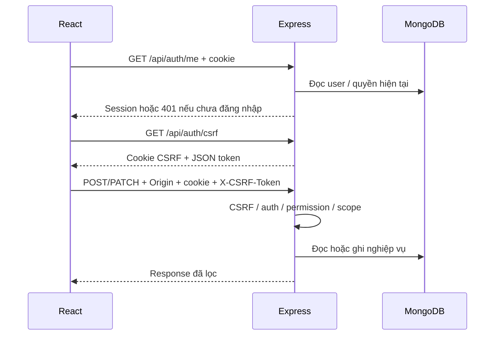

# Luồng xử lý từ UI tới dữ liệu

Các đường dẫn source dưới đây là điểm bắt đầu đọc. Tên người dùng/config trong ví dụ là giả.

## 1. Session và mutation



Đọc [auth.jsx](../client/src/auth.jsx) → [api.js](../client/src/api.js) → [auth route](../server/src/routes/auth.js) → [middleware auth](../server/src/middleware/auth.js). Chi tiết bảo mật trong [spec auth](auth-rbac-spec.md).

401 ở `/me` trước login là bình thường; 502 ở endpoint CSRF là lỗi proxy/backend, chưa phải token không khớp. CSRF origin sai là 403 ở mutation.

## 2. Sửa một config

[AccountConfigPage](../client/src/pages/AccountConfigPage.jsx) → PATCH `/api/bots/bot-demo/configs/DEMO_1` → [bots route](../server/src/routes/bots.js) → `getConfigDetail` trước sửa → `updateConfigSummary` trong [account-config-view](../server/src/lib/account-config-view.js) → kiểm tra bot/scope/env → `$set` field hợp lệ vào `account_configs` → diff/audit → response.

Bot giao dịch đọc cấu hình ở process riêng. Không nối mũi tên từ response lưu config sang “đã đổi lệnh trên sàn”. Bulk và thao tác Signal có danh sách lỗi từng env, không phải transaction tất cả hoặc không có gì.

## 3. Tìm rồi copy/sync config

[SignalSearchPage](../client/src/pages/SignalSearchPage.jsx) → GET `/api/bots/config-search` → [config-search](../server/src/lib/config-search.js) → lọc bot được phép, account_configs + account_statics → bảng hiệu suất → popup GET config/Static → POST `/:username/configs/:env/copy` → [copyAccount](../server/src/lib/bot-directory.js) → ghi config đích và liên kết account → audit `config.copied`.

Phân biệt mode new/replace/sync. User xem được nguồn chưa chắc sửa được đích. Tab Thống kê/Cấu hình Signal gọi [signal-setup](../server/src/lib/signal-setup.js), không đi qua config-search.

## 4. Position live

```mermaid
flowchart TD
    Page[PositionsPage] --> Rest[GET /api/positions]
    Page --> WS[/api/positions/ws]
    WS --> Auth[Cookie JWT + user từ Mongo khi upgrade]
    Auth --> Watch[watch / resume: kiểm tra account qua loadPositions]
    Watch --> Live[position-live]
    Redis[(Redis snapshot + notify)] --> Live
    Live --> View[positions: ghép position sàn với monitor]
    Mongo[(monitor_positions + user_accounts + heartbeat)] --> View
    Page --> Button[POST /api/positions/refresh]
    Button --> Book[positionRisk + openOrders + openAlgoOrders]
    Live --> Book
    View --> Page
```

Source: [position-ws](../server/src/lib/position-ws.js), [position-live](../server/src/lib/position-live.js), [position-cache](../server/src/lib/position-cache.js), [positions](../server/src/lib/positions.js).

Redis key `wb:pos:<account>`, channel `wb:pos:notify:<account>`; notice mang account/version/at. Web đọc snapshot, không lấy nội dung notice làm toàn bộ vị thế. Snapshot có age tối đa 90 giây để coi là fresh. Ba API sổ sàn chỉ chạy khi chưa có `wb:ex`, khi bấm cập nhật, hoặc sau 15 phút. Không có sổ sàn thì view vẫn là monitor Mongo, không đánh dấu đã đóng trên sàn. Snapshot `source=monitor` không được dùng làm danh sách vị thế. Mark price đến từ một websocket public của sàn; viewer đang mở được tính lại giá và PnL mỗi 15 giây, còn qty đổi thì đẩy ngay. Lệnh realtime của binance-bot ghi hash `wb:ord:<account>` và publish `wb:ord:notify:<account>`. Các message client: `watch`, `resume`, `pause`; server trả `snapshot` hoặc `error`. Đóng socket bỏ watcher. Chưa chọn tài khoản thì trang tự gọi lại GET mỗi 15 giây khi đang hiện; GET đó chỉ đọc Redis và chỉ gọi ba API sàn khi sổ `wb:ex` chưa có hoặc đã quá 15 phút.

REST dùng `account`, `audience`, `book` và các filter; chi tiết monitor dùng `/api/positions/detail?id=...`. Phân quyền không được bỏ qua vì dữ liệu lấy từ cache. Đọc [giới hạn WS](architecture.md#giới-hạn-hiện-tại) trước khi sửa auth/proxy.

## 5. Tổng kết và cache

[SummaryPage](../client/src/pages/SummaryPage.jsx) → [summary route](../server/src/routes/summary.js): nhánh snapshot hệ thống hoặc [system-summary](../server/src/lib/system-summary.js) theo actor → aggregate Mongo → response.

[summary-snapshots](../server/src/lib/summary-snapshots.js) dùng lease Mongo tránh nhiều process tính cùng range. Scheduler kiểm tra mỗi 60 giây. Ranges: today/3d/7d/30d/90d/all; freshness 2 phút, riêng all 15 phút; lease 2 phút. Không có payload và process khác đang tính có thể trả 503; refresh cưỡng bức không lấy được payload có thể trả 409. Version công thức nằm trong module; không dùng snapshot khác version như kết quả hiện tại.

`web_summary_cache` là lớp cache riêng trong system-summary, không đồng nghĩa `web_summary_snapshots`. Khi lần theo một request phải xem route thực sự gọi hàm nào, không chỉ thấy model tồn tại.

## 6. Lãi lỗ ví và AI

[AccountLedgerPage](../client/src/pages/AccountLedgerPage.jsx) → GET `/api/account-ledger` đọc DB. Nút refresh → POST `/:username/refresh` → [refreshLedger](../server/src/lib/account-ledger.js) → kiểm tra scope → lấy credential phía server → Binance balance/income ngày UTC → ghi `futures_profits` → UI đọc kết quả. Không trả API key cho browser.

[DashboardPage](../client/src/pages/DashboardPage.jsx) → POST `/api/dashboard/attention` → [dashboard-ai](../server/src/lib/dashboard-ai.js) gọi `getDashboard(actor)` → đóng gói facts qua [dashboard-brief](../server/src/lib/dashboard-brief.js) → provider AI → parse gợi ý, giới hạn link theo dữ liệu đầu vào. Thử tối đa hai provider đã cấu hình, timeout 12 giây mỗi lần; route giới hạn các lần hỏi gần nhau 15 giây.

## 7. Deploy

`npm run update` → kiểm tra checkout/upstream → git pull fast-forward → chạy deploy vừa pull → npm ci server/client → test server → build client → restart riêng PM2 web-bot → health loopback → copy asset, thay index.html cuối → pm2 save.

Build/dependency lỗi dừng trước restart theo luồng script; health lỗi giữ frontend cũ nhưng backend/dependency có thể đã đổi. Xem [runbook Debian](deploy-debian.md); không coi pull thành công là deploy thành công.
